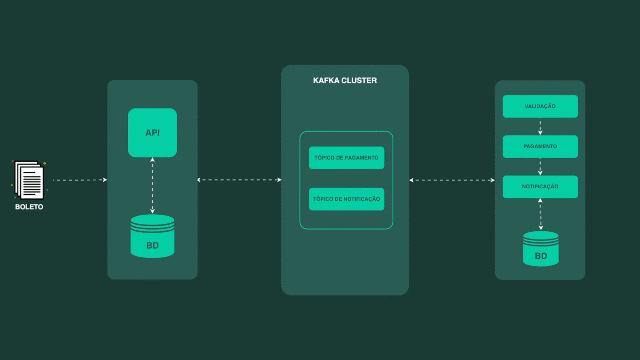

# Projeto Validador de Boleto

Projeto desenvolvido durante treinamento da JDevTreinamentos com objetivo de aprofundar conhecimentos sobre Mensageria com Kafka.

Instrutor: Luan Rocha.

### Tecnologias utilizadas
- Java
- Spring Boot
- Docker
- Apache Kafka
- Apache Avro
- Control Center
- Schema Registry
- Banco de dados H2

### Arquitetura do projeto
O projeto consiste em aplicações responsáveis por recepcionar, validar e pagar um boleto, 
onde a comunicação entre sistema acontece por mensageria.

Recebido um código de barras a aplicação salva em banco de dados h2 em memória o boleto e status INICIALIZADO.  
Em seguida a aplicação como Producer envia uma mensagem com o boleto para a aplicação 'validar-boleto' que inicia processo de validar o código de barras do boleto.

A aplicação 'validar-boleto' como Consumer recebe a mensagem.  
Inicia-se o processo de validar boleto e validar pagamento.  
Tendo um boleto válido o status é VALIDADO. Inválido é ERRO_VALIDACAO.  
Inicia-se o processo de pagamento.  
Tendo pagamento aprovado o status é PAGO. Tendo pagamento negado status é ERRO_PAGAMENTO.  
A aplicação validar-boleto notifica como um Producer enviando uma mensagem para a aplicação 'apiBoleto' o boleto atualizado com o status.  
A aplicacao 'apiBoleto' como um consumer recebe o boleto atualizado e atualiza o mesmo em banco.  

Para acessar documentação no Swagger utilize: 'http://localhost:8282/swagger-ui.html'

Abaixo alguns codigosBarras de exemplo:

- Para ocorrer status 'PAGO' caso de sucesso    
 use codigoBarras = '123'

- Para ocorrer status 'ERRO_VALIDACAO'  
Essa validacao ocorre no momento de validar o codigoBarras do boleto  
Se este codigoBarras é iniciado por 2  
use codigoBarras = '256'

- Para ocorrer status 'ERRO_PAGAMENTO':  
Este status ocorre quando na etapa de validacao de pagamento a quantidade de numeros é menor que 47 caracteres numéricos.  
Essa validação é executada depois de validar o boleto que deve ser um codigoBarras iniciado em 1 para ser um boletoValido.  
Use codigoBarras = '12345678998781454654651213210123124asdfadsfadfadfafda4252452452524'

